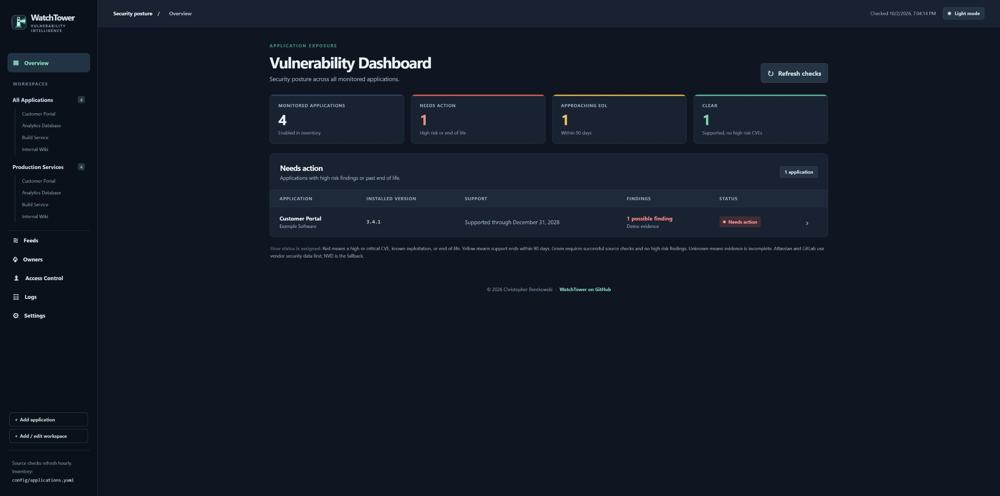
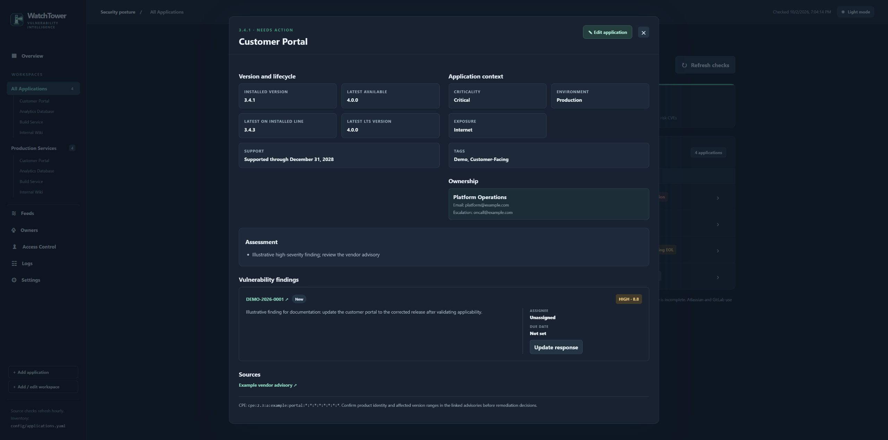
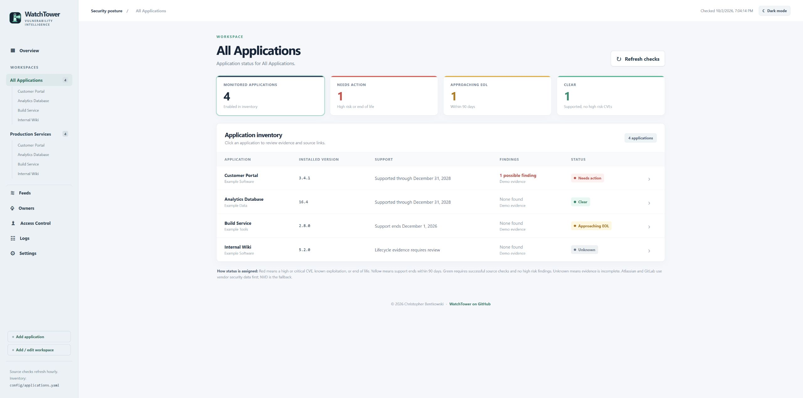

# WatchTower

WatchTower is a self-hosted application vulnerability and lifecycle dashboard. It tracks the software you operate, maps installed versions to NVD CPE records, checks vendor and community security feeds, identifies CISA Known Exploited Vulnerabilities, and compares releases with endoflife.date lifecycle data.

WatchTower is designed for a lightweight, single-container deployment. Configuration, scan results, notification state, and operational logs remain in persistent file storage. No database or external scheduler is required.

## See WatchTower

Screenshots from **WatchTower 0.10.0**, using fictional applications, contacts, and assessment evidence. Most examples use dark mode; light mode is also available.

[Explore the screenshot gallery](docs/SCREENSHOTS.md) or follow the [user guide](docs/USER_GUIDE.md).

## What WatchTower provides

- Application inventory organized into reusable workspaces.
- Guided CPE search, validation, and mapping tests against NVD data.
- Searchable lifecycle mapping with installed-version and support-state checks.
- NVD, CISA KEV, vendor feed, and GitHub advisory monitoring.
- Release, end-of-life, and vulnerability status in one dashboard.
- Workspace email notifications, reminders, and acknowledgement links.
- OpenID Connect sign-in and delegated access control.
- Separate system, feed, audit, and authentication logs available from the interface.
- Versioned, signed container images published to Docker Hub.

WatchTower is a triage tool. Its results depend on correct product mappings and the data available from external sources. Always confirm affected versions and remediation guidance with the software vendor.

## Documentation

### Installation and maintenance

- [Initial setup](docs/SETUP.md#initial-setup)
- [Container requirements](docs/SETUP.md#requirements)
- [Persistent storage](docs/SETUP.md#persistent-storage)
- [OpenID Connect setup](docs/SETUP.md#configure-openid-connect)
- [TLS and reverse proxies](docs/SETUP.md#tls-and-reverse-proxies)
- [Upgrading WatchTower](docs/SETUP.md#upgrade-watchtower)
- [Backup and rollback](docs/SETUP.md#backup-and-rollback)
- [Container troubleshooting](docs/SETUP.md#container-troubleshooting)

### Using WatchTower

- [First sign-in](docs/USER_GUIDE.md#first-sign-in)
- [Dashboard and status](docs/USER_GUIDE.md#dashboard-and-status)
- [Applications](docs/USER_GUIDE.md#applications)
- [CPE vulnerability mappings](docs/USER_GUIDE.md#cpe-vulnerability-mappings)
- [Lifecycle mappings](docs/USER_GUIDE.md#lifecycle-mappings)
- [Workspaces](docs/USER_GUIDE.md#workspaces)
- [Vendor and advisory feeds](docs/USER_GUIDE.md#vendor-and-advisory-feeds)
- [Email notifications](docs/USER_GUIDE.md#email-notifications)
- [General settings](docs/USER_GUIDE.md#general-settings)
- [Access control](docs/USER_GUIDE.md#access-control)
- [Logs and troubleshooting](docs/USER_GUIDE.md#logs-and-troubleshooting)

### Project information

- [Roadmap](ROADMAP.md)
- [Changelog](CHANGELOG.md)
- [Contributing](CONTRIBUTING.md)
- [Code of conduct](CODE_OF_CONDUCT.md)
- [Support](SUPPORT.md)
- [Security policy](SECURITY.md)
- [License](LICENSE)

## Container image

Public release images are published as `devynn76/watchtowervi:<version>`. Pin a specific version in production so upgrades are deliberate and reversible. The `latest` tag follows the newest successful release.

See [Initial setup](docs/SETUP.md#initial-setup) for a complete Docker deployment example.

## License

Copyright 2026 Christopher Bentkowski.

WatchTower is licensed under the [Apache License 2.0](LICENSE).
