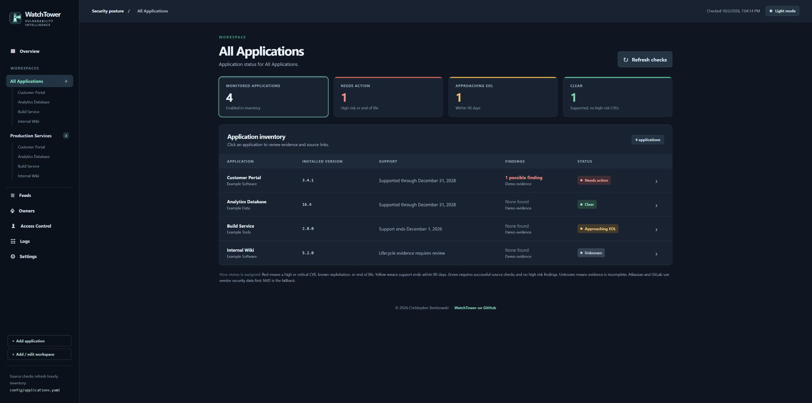
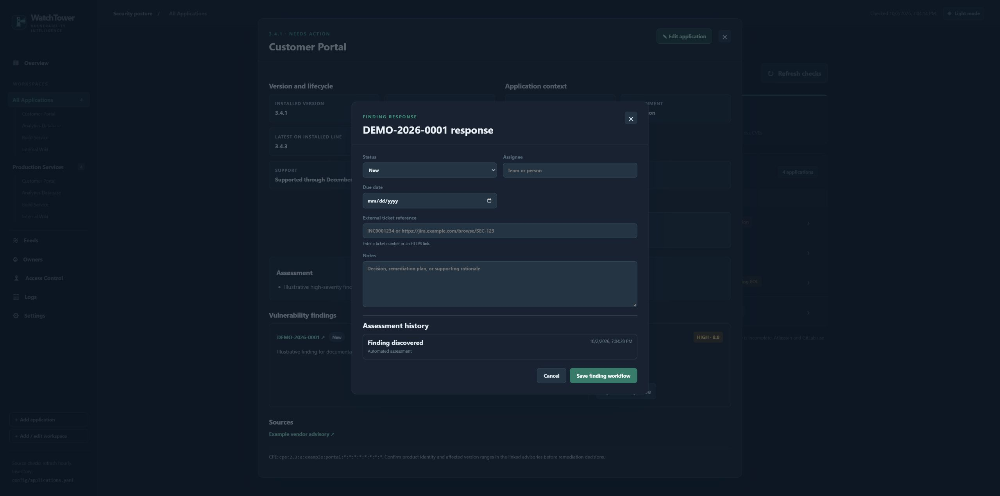
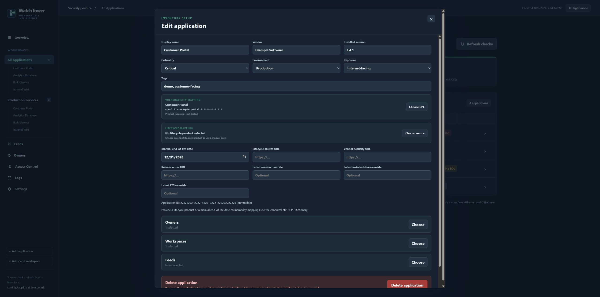
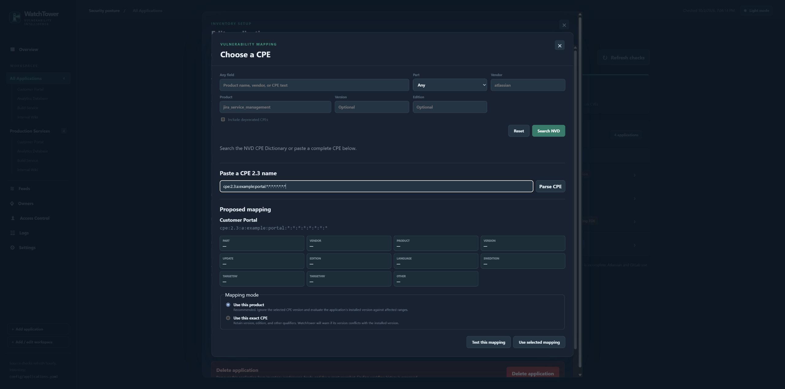
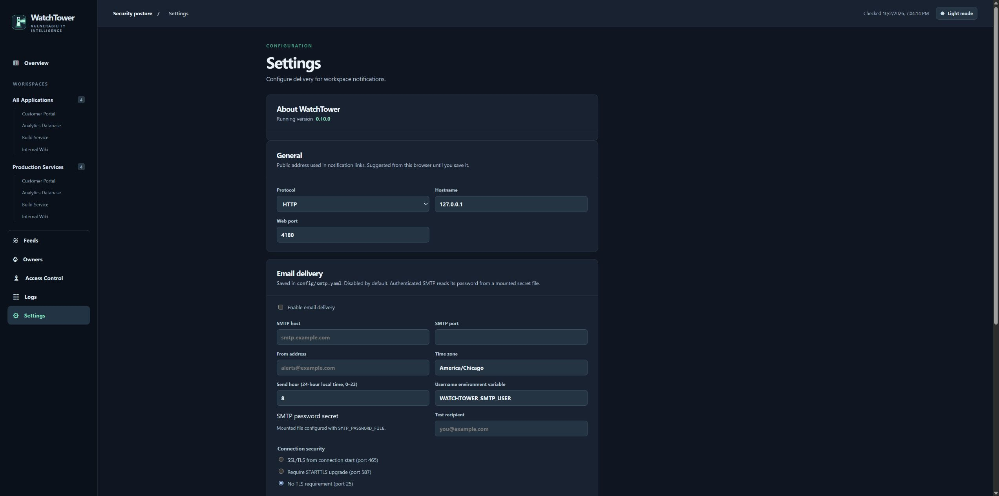
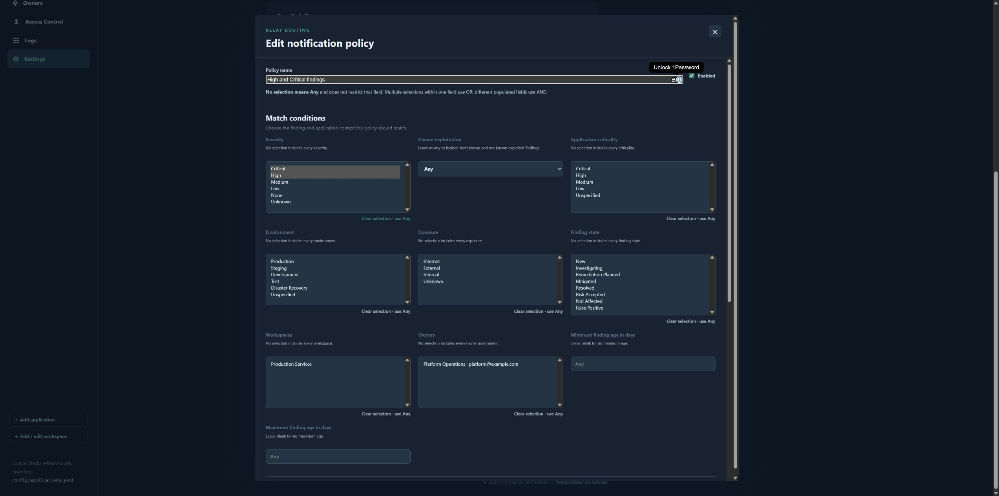
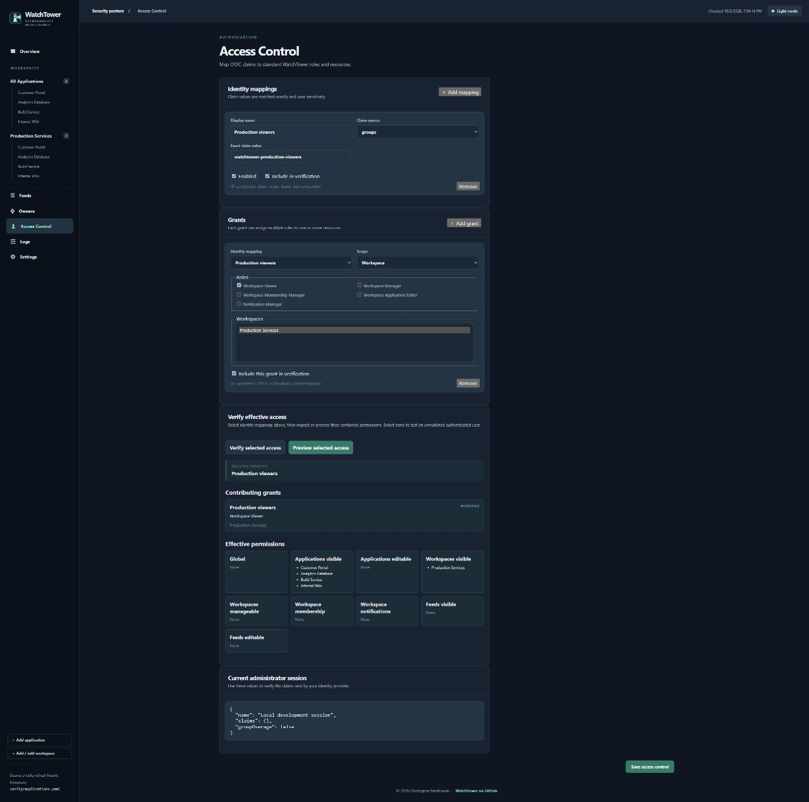
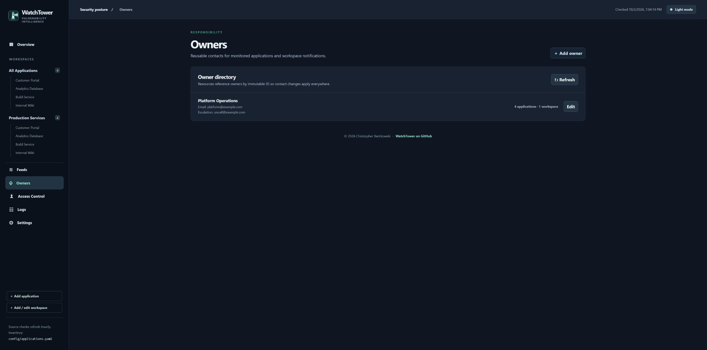
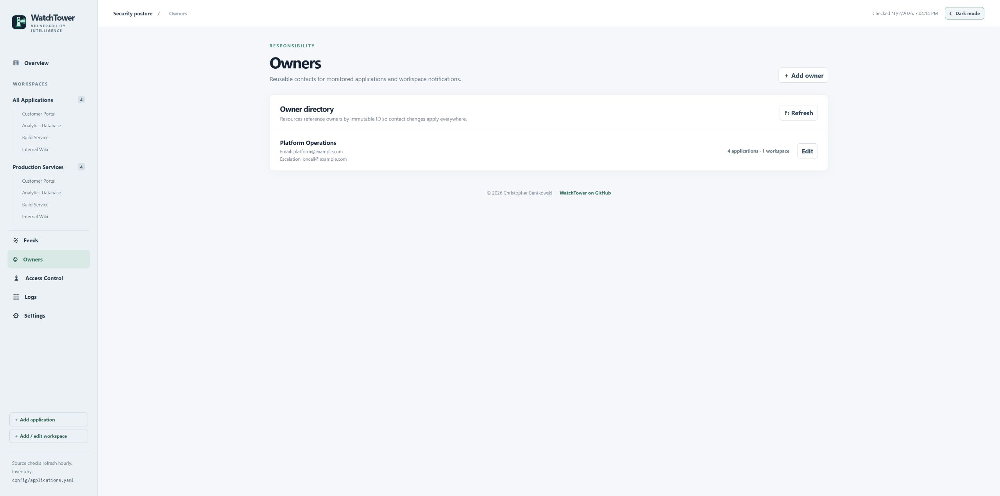

# WatchTower 0.10.0 screenshots

These are captures of the released v0.10.0 interface. Applications, owners, claim values, release targets, and assessment evidence are fictional examples. DEMO-2026-0001 is an illustrative finding, not a real CVE. Screenshots show an administrator session; delegated users see only permitted resources and controls.

Use the theme switch in the upper-right corner to change between dark and light mode.

## Overview

Status cards highlight applications needing action and approaching end of support.

## Application inventory

Workspaces share applications and show installed versions, support, findings, and status.

## Application details

Review releases, owners, local risk context, assessment reasons, and findings together.

## Finding response

Track disposition, assignee, due date, ticket reference, notes, and assessment history.

## Application editor

Maintain product identity, installed version, business context, mappings, and associations.

## CPE mapping

Parse a CPE, inspect its components, and select product or exact mapping before testing.

## Settings

Review the running release and configure the public address and email delivery.

## Notification policy

Combine finding and application conditions before previewing delivery and routing. The editor continues below the visible match conditions.

## Access control

Map an example identity-provider group to a workspace-viewer grant. Use verification to inspect effective permissions before saving.

## Owner directory

Reusable contacts link ownership and escalation information across resources.

## Application inventory in light mode

The same inventory and status indicators are available in light mode.

## Owner directory in light mode

Light mode also applies to administration pages.

See the [user guide](USER_GUIDE.md) for operating instructions and the [setup guide](SETUP.md) for deployment.
